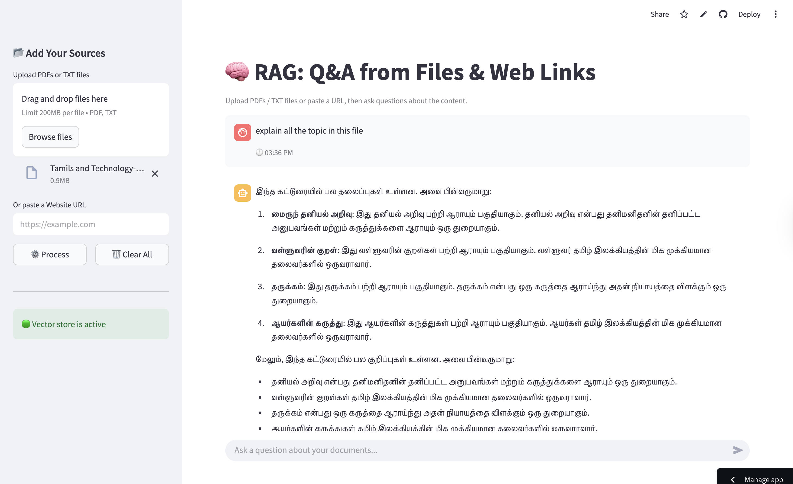

# 🧠 Simple RAG - Document & Website Q&A

A Retrieval-Augmented Generation (RAG) application built using **Streamlit**, **LangChain**, **FAISS**, and **HuggingFace embeddings**.

This app allows users to:
- 📄 Upload PDF or TXT documents
- 🌐 Paste a website URL
- 🔎 Ask questions about the content
- 📚 Retrieve relevant chunks using vector similarity search

---


## 📸 Application Screenshot



---

## 🚀 Features

- Drag & Drop file upload (PDF / TXT)
- Website scraping using WebBaseLoader
- Text chunking with RecursiveCharacterTextSplitter
- Vector storage using FAISS
- Embeddings using sentence-transformers
- Clean Streamlit UI
- Session-based memory
- Clear data functionality

---

## 🛠️ Tech Stack

- Python 3.10+
- Streamlit
- LangChain
- FAISS
- HuggingFace Embeddings
- BeautifulSoup (for web scraping)
- PyPDF

---

## 📂 Project Structure
```
ragintro/
│
├── rag_app.py
├── requirements.txt
├── .gitignore
└── README.md
```
---

## ⚙️ Installation

### 1️⃣ Clone Repository

```bash
git clone https://github.com/YOUR_USERNAME/YOUR_REPO_NAME.git
cd YOUR_REPO_NAME

Create Virtual Environment
python -m venv venv
source venv/bin/activate   # Mac/Linux

Install Dependencies
pip install -r requirements.txt
```
▶️ Run the App

streamlit run rag_app.py

##authored by 

kishore kumar


